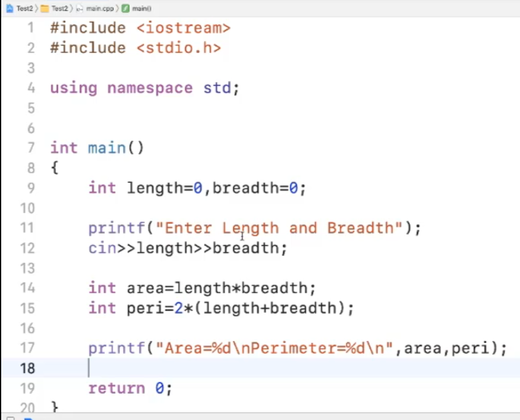
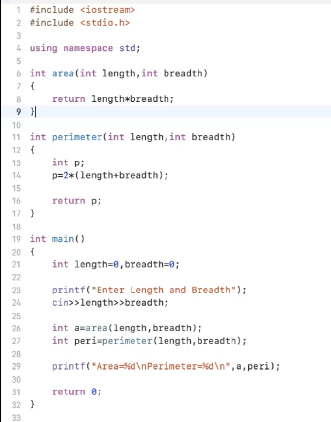
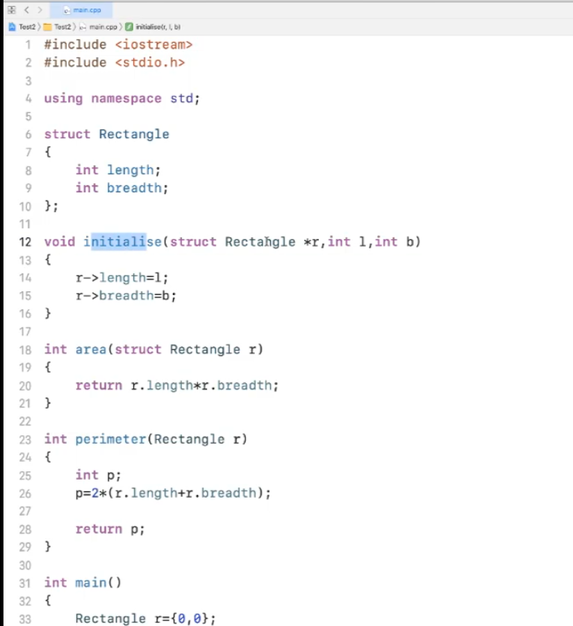
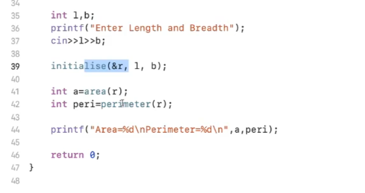
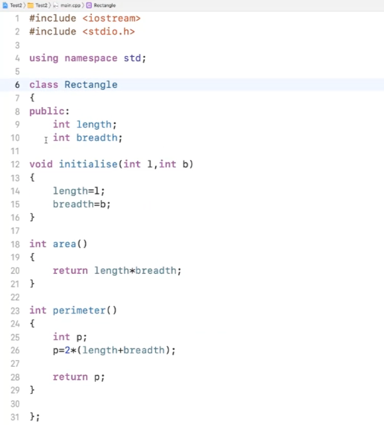
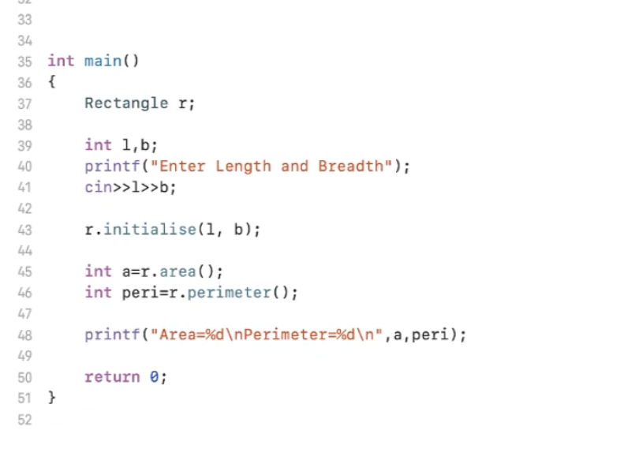

## day14
- Assigning the varibles to zero during declaration is a good approach 

      - example: int length =0, breadth =0;
      
      -  we assign zero to variables before use because in large programs sometime it may create some issues as without initialization it stores garbage value also Abdul bari explained it as cooking plate and serving plate. He told that it's just like cooking omlette in a cooking plate and later on serving in another plate though we can directly eat from cooking plate XD. Such a lovely example

## Monolithic Programming example:  

<h2>Modular or Procedural Programming example</h2>

 

<h2>Using Structure and Function Example</h2>

 
 

<h2> Object Oriented Program Example</h2>

